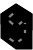

#  anigraph

A little webapp for visualising information and statistics about anime.


*A graph of shared tags among the top 100 popular anime on AniList with highlighted clusters*

## Usage

Visit [the deployed webapp](https://ccernusca.github.io/anigraph/)

Or:

Open `index.html` in a browser — no build step required.

Then:

1. Use the **media type buttons** in the topbar to select Anime, Manga, or Novel. All input modes and features work for each type.
   Use the **filter bar** (topbar, between type buttons and AniList link) to highlight matching circles — non-matching entries dim while typing. Supports combined queries: plain text matches titles, `#tag` matches tags or genres (case-insensitive, use `_` for spaces, e.g. `#slice_of_life`), `#tag:N` requires the tag to have community acceptance ≥ N% (e.g. `#action:70`). Multiple terms are ANDed — e.g. `naruto #action:80 #shounen` shows only entries whose title contains "naruto" and which have the "action" tag at ≥ 80% acceptance and the "shounen" genre/tag. A rank threshold on a tag token disables genre matching for that token.
2. Use the **right sidebar** to choose an input mode: **Local** (import a `.txt` file, one title per line), **Popular** (top N by popularity), or **Profile** (AniList username). In Profile mode, use the status checkboxes to select which list statuses to include (Current, Completed, Paused, Dropped, Planning, Repeating — all checked by default). Click **Search**.
3. Matching entries appear as **circles** in a live physics simulation — nodes repel each other, shared-selection connections act as springs.
4. **Drag** the center area to pan. **Scroll** over the center area to zoom.
5. **Hover** a circle to see a popup with genres and community-rated tags; its connection lines highlight.
6. **Hover** a connection line (in the center area) to see shared selection items (tags or genres); its two endpoint circles highlight.
7. Click **↗** in the popup to open the entry's AniList page.
8. The **left sidebar** shows total entry and connection counts, plus a bar chart of selection items sorted by how many connections they appear in. **Hover** a bar to highlight all connections, circles, and the matching cluster polygon.
9. **Cluster polygons** are drawn around groups sharing a selection item. **Hover** a polygon to highlight it and its connections. Labels sit outside the polygon border, placed to avoid overlapping other labels.
10. The controls in the **right sidebar** can be used to change selection criteria for connections and clusters, such as community acceptance of a tag or number of connections in a cluster.
11. Use the **Visuals** checkboxes in the right sidebar to toggle rendering of connections, covers, cluster polygons, and cluster labels independently.


*An image of the full interface of anigraph*


*Top 100 Anime being filtered for "Attack on Titan"*

Anime sharing selection items are connected by lines. Spring stiffness and line opacity scale with connection strength (relative to the strongest connection). Configure physics and selection in the right sidebar:

| Setting | Effect |
|---------|--------|
| Spring strength | Controls spring force in the physics simulation |
| % cutoff | Tags above a minimum acceptance % |
| Top N | Top N tags by acceptance (slider max = tag count in data) |
| Top % | Top fraction of tags by acceptance |
| Genres | All genres (connections and highlights based on genres) |
| Min cluster size | Minimum connections a tag needs to appear as a cluster polygon and stat bar |

Unmatched titles are silently omitted. Feedback (errors, rate limits) appears below the search button.

## Favicon

`favicon.svg` — inline SVG depicting "a" and "g" overlaid as one node-graph.

## Project structure

```
index.html      entry point
favicon.svg     browser tab icon
css/style.css   global styles
js/main.js      application logic
```
